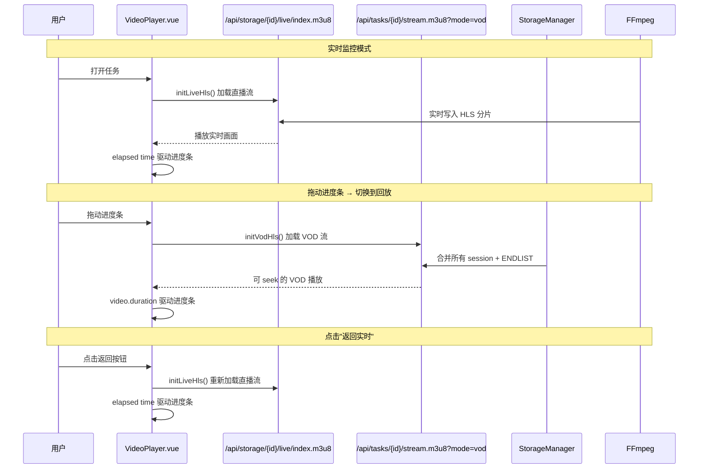

# 架构设计文档

本系统致力于构建一个高效、稳定且易于扩展的火灾监测平台，核心架构采用了**前后端分离**的微服务化设计思路。

## 系统架构图

```mermaid
graph TD
    User((用户)) <--> Frontend[前端层: Vue3 + Ant Design Vue]
    Frontend <-->|HTTP / WebSocket| Backend[后端层: FastAPI]
    
    subgraph Backend
    subgraph NotificationLayer
        Notifier[Notifier: State Wall]
    end
    
    subgraph ExecutionLayer
        Grabber(Grabber Thread)
        Detector(Inference Thread)
        Sentinel(Sentinel Ticker Thread)
    end
    
    subgraph StorageLayer
        StorageManager[StorageManager: Session HLS]
        FFmpeg[FFmpeg: HLS Pipe Writer]
    end
    
    subgraph ExternalSources
        RealStream(第三方视频源/监控探头)
        Simulator{{可选: 模拟器 Simulator}}
    end
    
    RealStream <--> ExecutionLayer
    ExecutionLayer --> StorageManager
    StorageManager --> FFmpeg
    Sentinel -.->|Handshake| Notifier
    ExecutionLayer -.->|Broadcast| Notifier
    Notifier <--> Frontend
    
    subgraph VideoDelivery
        LiveHLS[Live M3U8: /api/storage/id/live/index.m3u8]
        VodHLS[VOD M3U8: /api/tasks/id/stream.m3u8?mode=vod]
    end
    
    StorageManager --> LiveHLS
    StorageManager --> VodHLS
    Frontend <--> LiveHLS
    Frontend <--> VodHLS
    
    Backend <--> DB[(数据层: SQLite)]
    Backend <--> Filesystem[[工程数据: Models/Uploads/Results/VideoStorage]]
```

## 技术选型

- **Frontend**: Vue 3 + Ant Design Vue 4.x + Vite
- **Backend**: FastAPI (异步高性能) + SQLModel (现代 ORM)
- **AI Core**: ONNX Runtime (高性能推理，支持 YOLOv8 等导出模型)
- **Video Delivery**: HLS (hls.js) — 统一实时监控与历史回放
- **Stability**: Sentinel Ticker (Heartbeat) + Debounced UI Loaders
- **Networking**: WebSocket + State-Aware Broadcaster

---

## 核心业务逻辑实现

### 1. 智能推理引擎 (Detector)
`Detector` 类封装了对模型推理的底层复杂性。在 **v1.2.0** 版本中，除了具备 1:1 裸传映射能力外，推理引擎还与任务生命周期进行了深度解耦，支持热切换模型而无需重启直播流。

### 2. 状态感知分发 (Notifier State Wall)
为了解决高频刷新的“刷新风暴”，系统在分发层加装了**状态防火墙**：
- **上游拦截**: `Notifier` 单例会缓存每个任务的最后一次广播内容。
- **差异推送**: 只有当任务的状态或消息发生实质性变化时，信号才会越过防火墙到达 WebSocket。
- **效果**: 相比 v1.1.0，WebSocket 网络负载降低了 90% 以上。

### 3. 视频流状态机与稳定性协议 (VideoStream Protocol)
针对实时监控流，系统在 **v1.2.0** 中实现了更精细的 **6 状态机** 与 **UI 解耦逻辑**：

- **精细化 6 状态**:
    1. **connecting**: 启动后的 5s 握手保护期，强制展示“正在连接...”。
    2. **retry**: 握手失败后进入 3s 节奏重连期（最多 5 次）。
    3. **loading**: 已建立流对象，但尚未捕获到有效首帧。
    4. **running**: 正常推送帧数据。
    5. **exception**: 5 次重试均失败，记录错误并停止尝试。
    6. **stopped**: 用户手动停止任务。

- **UI 冻结与物理停止解耦**:
    - **预览暂停 (Freeze)**: 仅在前端停止画面渲染，不影响后端 Grabber 和 Detector 的运行。
    - **逻辑停止 (Stop)**: 物理关闭后端拉流句柄，将任务状态重置为 `pending`。

- **全局状态墙 (State Wall)**:
    - 后端通过 `Notifier` 实时广播状态变更。
    - 前端播放器具备**自动重连 (Auto-Sync)** 能力：当监控中的任务被外部触发执行时，播放器会自动检测并恢复连接。

---

## 数据存储策略

- **结构化数据**: 存储在 SQLite (`fire_detection.db`) 中，方便单机部署与数据追溯。
- **二进制数据**: 
  - `backend/data/models/`: 用户上传的模型权重文件。
  - `backend/data/uploads/`: 原始图片/视频数据。
  - `backend/data/results/`: 处理后的可视化结果文件。
  - `backend/data/video_storage/{task_id}/`: HLS 录制分片存储。
    - `live/`: 当前活跃的录制 session（FFmpeg 实时写入）。
    - `session_N/`: 已封包的历史 session（含 `index.m3u8` 和 `seg_*.ts`）。
    - `sessions_meta.json`: Session 元数据（索引、起始时间、时长、是否活跃）。

## 视频流交付架构 (v1.2.5)

系统采用**双 URL HLS 架构**，将实时监控与历史回放在传输层彻底分离：



### 关键设计决策
1. **直播使用直接 FFmpeg m3u8**：避免 merged playlist 在任务刚启动时返回空内容导致白屏。
2. **VOD 使用 merged m3u8 + ENDLIST**：`#EXT-X-ENDLIST` 使 hls.js 将其视为 VOD 类型，支持随机 seek。
3. **Session DISCONTINUITY 标记**：跨 session 播放时用 `#EXT-X-DISCONTINUITY` 标记编码参数可能变化，避免解码器崩溃。

> [!NOTE]
> 整个 `backend/data/` 目录已被 `git` 忽略，以保证代码仓库的纯净。实际生产环境下建议挂载分布式存储。
