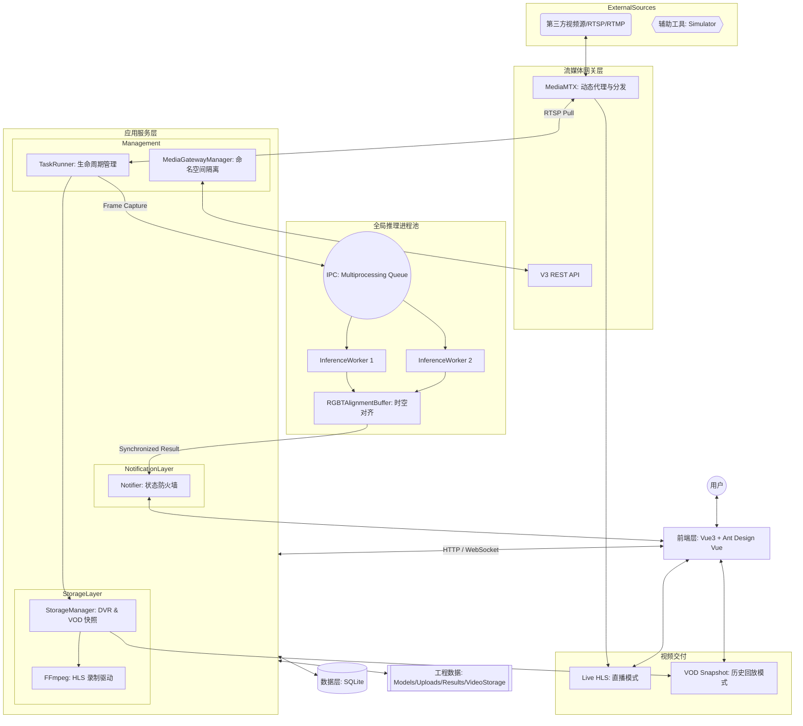
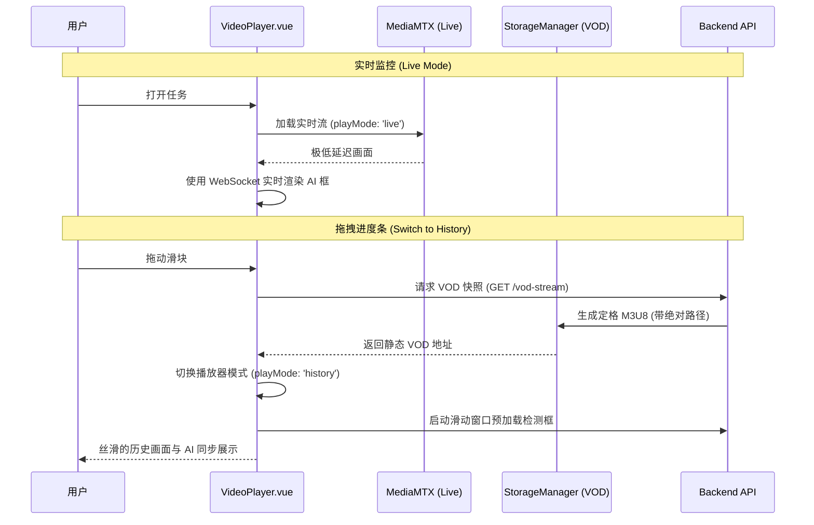

# 架构设计文档 (v1.4.0 工业级重构版)

本系统在 **v1.4.0** 版本中完成了深度架构重构，从单进程模型进化为**分布计算与网关化分发**的工业级架构。

## 系统架构图

## 核心重构特性 (v1.4.0+)

### 1. 外部流媒体网关集成 (Media Gateway)
系统引入了 **MediaMTX** 作为统一的流媒体网关。
- **动态代理**：后端通过 `MediaGatewayManager` 动态申请代理路径，实现对内网私有流的命名空间隔离（`fg_` 前缀）。
- **解耦拉流**：业务逻辑不再直接面对多变的源协议，而是统一从网关拉取标准的 RTSP/HLS 流。

### 2. 推理进程隔离与 IPC 优化 (Process Isolation)
为了绕过 Python 的 GIL 限制并提升多路并发性能：
- **全局进程池**：AI 推理任务被分发到独立的子进程中执行。
- **JPEG 压缩传输**：在 Windows `spawn` 模式下，为了平衡序列化开销与开发复杂度，系统采用了高效的 JPEG 压缩进行进程间通信（IPC），将 1080P 高清帧的传输压力降低了 90%。

### 3. RGBT 时空对齐缓冲区 (Temporal Alignment)
针对双光（红外+可见光）监测场景，系统实现了 `RGBTAlignmentBuffer`：
- **时间窗口对齐**：通过毫秒级时间戳比对，自动寻找物理时间最接近（容差 < 100ms）的双路帧进行特征融合。
- **防抖动处理**：有效解决了因网络抖动导致的红外与可见光画面“张冠李戴”问题。

### 4. 工业级 HLS DVR 状态机
系统采用了**“前端状态机隔离 + 后端动态 VOD 快照”**的联合方案：
- **直播模式**：直接消费 MediaMTX 的实时 M3U8，确保极低延迟。
- **历史模式**：一旦用户拖拽进度条，后端 `StorageManager` 会瞬间生成一个包含 `#EXT-X-ENDLIST` 和绝对路径重写的静态 M3U8（VOD Snapshot）。
- **帧对齐同步**：前端渲染引擎深度集成了 HLS 的 `programDateTime`，确保历史回放中的 AI 检测框与视频画面在每一帧都完美对齐。

---

## 数据存储策略

- **结构化数据**: 存储在 SQLite (`fire_detection.db`) 中，`detection_records` 表已在 `detected_at` 字段建立索引以支持极速历史回放。
- **视频存储**: 
  - `backend/data/video_storage/{task_id}/`: 存储 HLS 切片。
  - 系统具备**预测性清理逻辑**，根据磁盘空间剩余自动触发旧切片回收。

## 视频流交付架构 (v1.4.0)

> [!IMPORTANT]
> 工业级重构显著提升了系统的稳定性，支持 7x24 小时不间断录制与毫秒级 AI 框同步。
