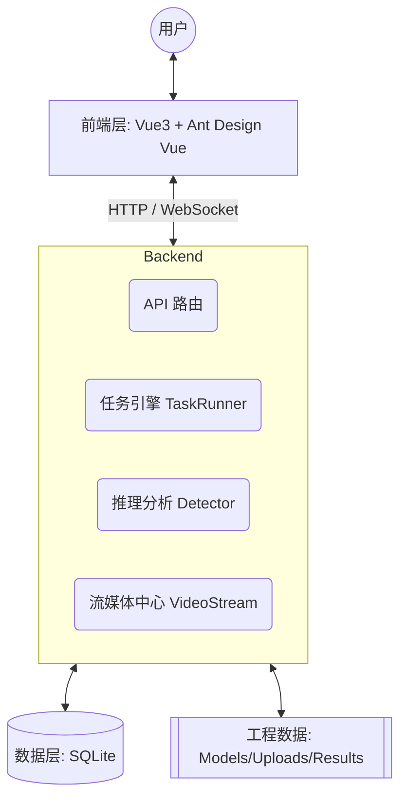

# 架构设计文档

本系统致力于构建一个高效、稳定且易于扩展的火灾监测平台，核心架构采用了**前后端分离**的微服务化设计思路。

## 系统架构图

## 技术选型

- **Frontend**: Vue 3 + Ant Design Vue 4.x + Vite
- **Backend**: FastAPI (异步高性能) + SQLModel (现代 ORM)
- **AI Core**: YOLO (Ultralytics) + ONNX Runtime (高性能推理)
- **Stream**: OpenCV + mpegts.js

---

## 核心业务逻辑实现

### 1. 智能推理引擎 (Detector)
`Detector` 类封装了对模型推理的底层复杂性。针对不同深度学习模型输出标签索引不一致（如索引 0 可能代表背景也可能代表烟雾）的问题，我们实现了**动态偏移自动矫正机制**：

- **策略 A (Metadata Audit)**: 在加载 ONNX 模型时，自动读取元数据中的类别总数。若模型类别比用户定义的标签多 1 且第一个标签为 "background"，则自动应用 `-1` 偏移。
- **策略 B (Dynamic Sentry)**: 针对无元数据的模型，在推理过程中进行“全局哨兵扫描”。若检测到的最大索引超过了用户定义的映射范围，实时锁定修正量，确保语义识别 100% 正确。

### 2. 后台任务调度 (TaskRunner)
系统采用 `asyncio.Queue` 构建单并发任务队列（可根据配置水平扩展）：
1. 任务请求进入队列。
2. `TaskRunner` 定时检查并捞取队列首位。
3. 动态加载关联的模型文件。
4. 串行处理图片/视频序列，并将结果实时写入数据库。

### 3. 三维联动流媒体 (VideoStream)
针对实时监控流：
- **解码**: 基于 OpenCV 获取 RTSP/RTMP 指令。
- **处理**: 逐帧注入 `Detector` 进行标注绘制。
- **传输**: 将渲染后的帧转换为 Base64，通过 WebSocket 实时推送到前端 `VideoPlayer` 组件。

---

## 数据存储策略

- **结构化数据**: 存储在 SQLite (`fire_detection.db`) 中，方便单机部署与数据追溯。
- **二进制数据**: 
  - `backend/data/models/`: 用户上传的模型权重文件。
  - `backend/data/uploads/`: 原始图片/视频数据。
  - `backend/data/results/`: 处理后的可视化结果文件。

> [!NOTE]
> 整个 `backend/data/` 目录已被 `git` 忽略，以保证代码仓库的纯净。实际生产环境下建议挂载分布式存储。
