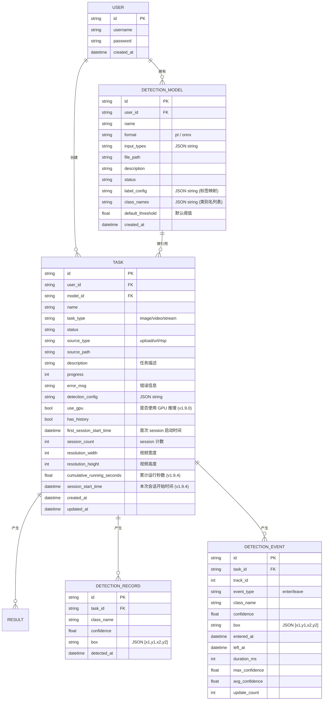

# 数据库设计文档

本系统采用 **SQLModel** (基于 SQLAlchemy 与 Pydantic) 进行模型定义。
- **开发存储**: 路径位于 `backend/data/fire_detection.db`。
- **测试隔离**: 自动化测试使用独立数据库 `backend/test.db`，确保研发数据不受干扰。

## 实体 ER 关系

## 核心表字段说明

### 1. 模型表 (DetectionModel)
用于管理 AI 算法文件及其类别映射。
- **label_config**: 这是一个关键字段，存储为 JSON 字符串。它记录了模型输出索引与业务语义的转换关系（如 `{0: "smoke", 1: "fire"}`）。前端的映射编辑器会直接修改此字段。
- **input_types**: 标记模型支持的波段（如 `["rgb"]`），用于在创建任务时进行兼容性过滤。

### 2. 任务表 (Task)
记录检测执行的实例。
- **status**: 核心状态机。包括：
    - `pending`: 初始创建态。
    - `initializing` (v1.9.4 新增): 后端正在初始化（连接视频源+加载推理模型+生成HLS流），五要素尚未就绪，用户不可查看。
    - `running`: 后端已就绪并持续产出五要素数据，用户点击查看可看到当前时刻的五位一体画面。
    - `completed`: 任务正常退出。
    - `failed`: 发生致命异常（不可恢复，通常为 image/video 类型）。
    - `exception`: 运行时异常（可重试，通常为 stream 类型的视频源问题，可能有历史数据可供查看）。
- **source_path**: 物理文件的存储路径或流地址。
- **detection_config**: JSON 字符串，存储检测配置（类别阈值、启用/禁用等）。
- **use_gpu** (v1.9.0 新增): 布尔值，标记任务是否使用 GPU 推理。默认 `False`。当设为 `True` 时，推理管线使用 `CUDAExecutionProvider`。
- **has_history**: 标记任务是否有历史视频/检测记录。
- **first_session_start_time**: 任务首次启动录制的时间，用于进度条时间对齐。
- **session_count**: 任务累计启动次数，用于 session 目录命名。
- **resolution_width / resolution_height**: 视频分辨率，用于检测框坐标映射。
- **cumulative_running_seconds** (v1.9.4 新增): 累计运行秒数（不含停止期间），用于前端实时模式独立计时器计算直播时长。每次任务停止/异常时，将本次会话运行时间累加到此字段。
- **session_start_time** (v1.9.4 新增): 本次会话开始时间（`initializing → running` 时记录），用于与 `cumulative_running_seconds` 配合计算当前实时运行时长。

### 2.5 检测记录表 (DetectionRecord)
存储每次检测的结果（每帧一条记录）。
- **task_id**: 关联的任务 ID。
- **class_name**: 检测到的类别名称。
- **confidence**: 检测置信度 (0-1)。
- **box**: 检测框坐标 `[x1, y1, x2, y2]`，存储为 JSON 字符串。
- **detected_at**: 检测时间（北京时间），已建立索引。

### 2.6 检测事件表 (DetectionEvent)
事件驱动的检测记录模型，每个目标生命周期一条记录（Enter -> Update x N -> Leave）。
相比 DetectionRecord 的每帧一条记录，数据量减少 99.8%。
- **task_id**: 关联的任务 ID。
- **track_id**: 目标追踪 ID。
- **event_type**: 事件类型 (`enter` / `leave`)。
- **class_name**: 检测到的类别名称。
- **confidence**: 检测置信度 (0-1)。
- **box**: 检测框坐标，存储为 JSON 字符串。
- **entered_at**: 目标进入时间。
- **left_at**: 目标离开时间（leave 事件时填充）。
- **duration_ms**: 目标持续时间（毫秒）。
- **max_confidence**: 生命周期内最高置信度。
- **avg_confidence**: 生命周期内平均置信度。
- **update_count**: 更新次数。

### 3. 用户表 (User)
基础登录信息。密码经过加密哈希处理（在 `auth.py` 中处理）。

---

## 运维与自愈机制 (v1.2.0)

1.  **僵尸状态清理**: 系统在后端启动时，会自动扫描所有数据库中仍处于 `running` 状态的任务，并将其统一修正为 `pending`。这解决了非正常停机导致的死锁任务。
2.  **数据原子性**: 在每一轮视频流重启之前，后端服务都会强制执行 `commit()` 操作，确保数据库字段与系统实际运行状态严格对齐。

---

## 性能与优化

1.  **索引优化**: 对 `user_id` 和 `created_at` 字段建立了复合索引，以保障在多用户大数据量场景下列表查询的效率。
2.  **约束**: 
    - 模型在删除前会检查 `Task` 表是否仍有正在引用它的任务。
    - 数据库文件完全本地化，支持零配置即插即用。

---

> [!TIP]
> 开发者可以使用 SQLite 查看工具（如 DB Browser for SQLite）打开 `backend/data/fire_detection.db` 直接观察数据变化。在开发模式下，任何对 `sqlmodel` 实体的修改都会通过 `create_db_and_tables()` 在启动时自动同步（表结构新增字段）。

---

## 5. 模型元数据提取 (v1.2.3)

在 v1.2.3 中，系统增强了对 ONNX 元数据的自适应能力：
- **实时解析**: 通过 `POST /models/analyze` 接口，系统可在不入库的情况下从 ONNX 文件的 `names`/`metadata` 字段中提取类别映射。
- **映射优先级**: 前端获取解析后的 `label_config` 后，用户可进行二次编辑，最终以用户确认的 JSON 映射为准存入数据库。
