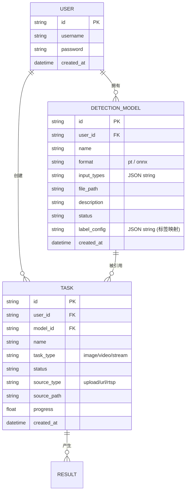

# 数据库设计文档

本系统采用 **SQLModel** (基于 SQLAlchemy 与 Pydantic) 进行模型定义，底层默认使用 **SQLite** 数据库，存储路径位于 `backend/data/fire_detection.db`。

## 实体 ER 关系

## 核心表字段说明

### 1. 模型表 (DetectionModel)
用于管理 AI 算法文件及其类别映射。
- **label_config**: 这是一个关键字段，存储为 JSON 字符串。它记录了模型输出索引与业务语义的转换关系（如 `{0: "smoke", 1: "fire"}`）。前端的映射编辑器会直接修改此字段。
- **input_types**: 标记模型支持的波段（如 `["rgb"]`），用于在创建任务时进行兼容性过滤。

### 2. 任务表 (Task)
记录检测执行的实例。
- **status**: 记录当前进度。状态包括 `pending`, `running`, `completed`, `failed`。
- **source_path**: 物理文件的存储路径或流地址。

### 3. 用户表 (User)
基础登录信息。密码经过加密哈希处理（在 `auth.py` 中处理）。

---

## 性能与优化

1.  **索引优化**: 对 `user_id` 和 `created_at` 字段建立了复合索引，以保障在多用户大数据量场景下列表查询的效率。
2.  **约束**: 
    - 模型在删除前会检查 `Task` 表是否仍有正在引用它的任务。
    - 数据库文件完全本地化，支持零配置即插即用。

---

> [!TIP]
> 开发者可以使用 SQLite 查看工具（如 DB Browser for SQLite）打开 `backend/data/fire_detection.db` 直接观察数据变化。在开发模式下，任何对 `sqlmodel` 实体的修改都会通过 `create_db_and_tables()` 在启动时自动同步（表结构新增字段）。
